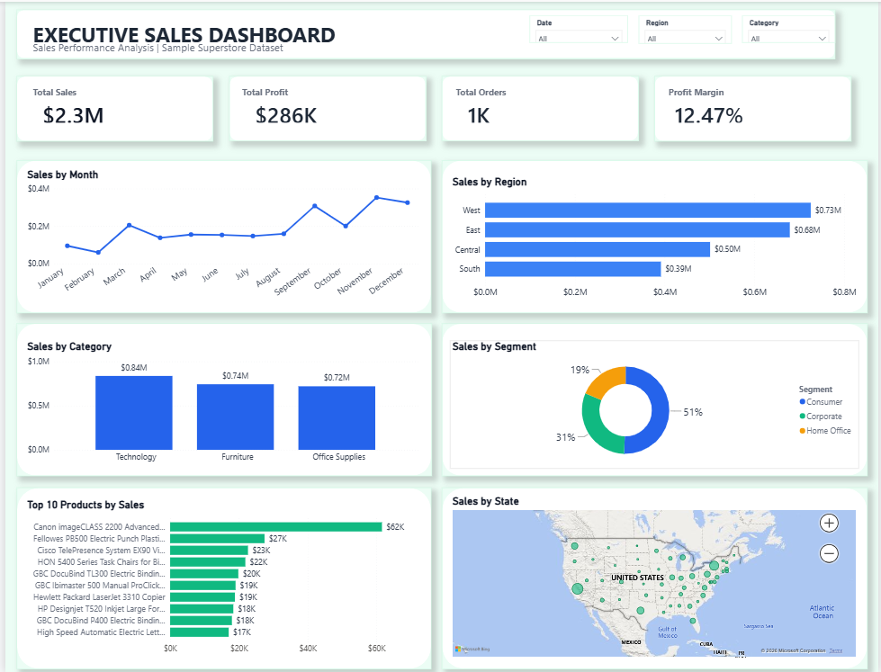

# Executive Sales Dashboard – Superstore Dataset

## Project Overview

This project was completed as part of the AnalystLab Africa Data Analytics Internship (Week 4).

The objective was to analyze Superstore sales data and build an interactive Power BI dashboard that helps users monitor sales performance, identify trends, and support business decisions.

## Dataset

- **Dataset:** Superstore Sales Dataset
- **Source:** Kaggle
- **Business Domain:** Retail Sales

- ## Tools Used

- Microsoft Power BI
- Microsoft Excel

- ## Dashboard Features

The dashboard includes:

- KPI cards for Total Sales, Total Profit, Total Orders, and Profit Margin
- Monthly Sales Trend
- Sales by Category
- Sales by Region
- Sales by Segment
- Top 10 Products by Sales
- Sales by State Map
- Interactive slicers for Region, Category, and Date
- Cross-filtering between visuals

## Dashboard Preview

### Executive Sales Dashboard

## Key Insights

From the dashboard, the following insights were identified:

- Technology recorded the highest sales among all product categories.
- The Consumer segment generated the largest share of total sales.
- The West region achieved the highest sales performance.
- Sales were stronger towards the end of the year.
- Canon imageCLASS 2200 Advanced Copier was the top-selling product.

 ## Files Included

- Executive_Sales_Dashboard.pbix
- Week4_Presentation.pptx
- Dashboard_Screenshot.png

  ## Author

**Damilola Owolabi**

Completed as part of the AnalystLab Africa Data Analytics Internship – Week 4.
